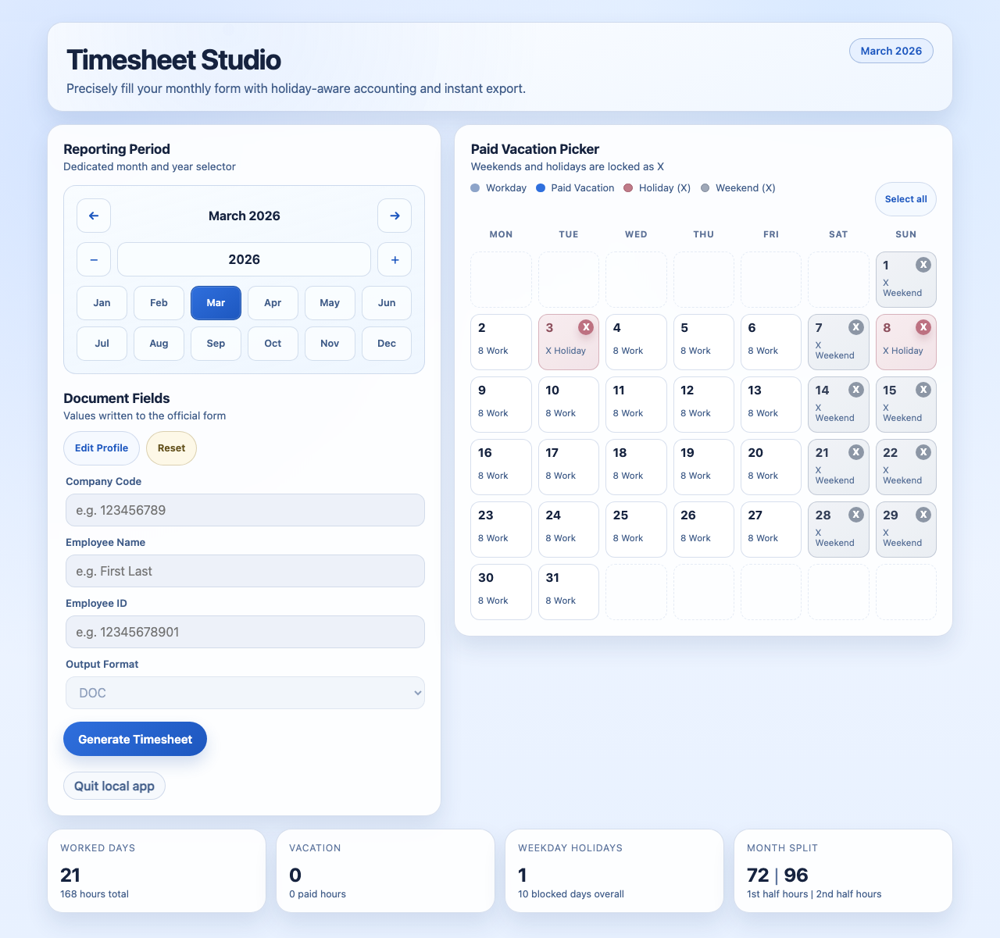

# Timesheet Studio

[](https://github.com/gati3478/timesheet-generator/actions/workflows/ci.yml)
[](LICENSE)
[](https://nodejs.org/)
[](https://kit.svelte.dev/)
[](https://v2.tauri.app/)

A SvelteKit web application that automates generating Georgian-format monthly timesheets. It computes worked days, vacation days, and public holidays, fills an official DOCX template via XML manipulation, and returns the completed document — ready for submission.

Available as a **web app** (browser-based) and a **desktop app** (macOS, Windows, Linux) via [Tauri](https://v2.tauri.app/).

Built for organizations operating under Georgian labor regulations that require standardized monthly timesheet forms.

<!-- TODO: Add screenshot

-->

## Features

- **Interactive Calendar UI** — Visual month calendar with click-to-toggle vacation selection. Weekends and public holidays are automatically locked.
- **Georgian Holiday Integration** — Fetches official Georgian public holidays from two sources ([date.nager.at](https://date.nager.at) + [yell.ge](https://www.yell.ge)) with automatic fallback and 6-hour caching.
- **DOCX Template Engine** — Fills the official timesheet template using XPath-based XML DOM manipulation, preserving the original document formatting.
- **Dual Output Formats** — Export as modern `.docx` or legacy `.doc` (via LibreOffice CLI conversion).
- **Smart Day Codes** — Automatically assigns Georgian-standard codes: `8` (worked), `შ` (paid vacation), `X` (holiday/weekend).
- **Payroll-Ready Metrics** — Calculates first-half/second-half hour splits, total worked hours, vacation hours, and weekday holiday counts.
- **Profile Persistence** — Employee name, company code, and ID saved to localStorage across sessions.
- **Input Validation** — Prevents invalid vacation selections (weekends, holidays) with detailed error messages.
- **Responsive Design** — Fully responsive from desktop down to mobile with breakpoints at 1140px, 1024px, 760px, 640px, and 430px.
- **Accessible** — Full ARIA labels, semantic HTML, keyboard navigation for all controls.

## Quick Start

### Prerequisites

- [Node.js](https://nodejs.org/) v18+ (v22 recommended, pinned in `.nvmrc`)
- [LibreOffice](https://www.libreoffice.org/) (required for template preparation and `.doc` export)

### One-Command Launch

```bash
git clone https://github.com/gati3478/timesheet-generator.git
cd timesheet-generator
npm start
```

`npm start` handles everything automatically:

1. Installs dependencies (if `node_modules/` missing)
2. Prepares the DOCX template from `.doc` source (if not already built)
3. Checks port availability
4. Starts the dev server
5. Opens your browser to [http://localhost:5173](http://localhost:5173)

Override host/port with environment variables:

```bash
HOST=0.0.0.0 PORT=3000 npm start
```

### Manual Setup

If you prefer step-by-step control:

```bash
# 1. Install dependencies
npm install

# 2. Convert the source .doc template to .docx (requires LibreOffice)
npm run prepare:template

# 3. Start the dev server
npm run dev
```

### Environment Check

Verify your environment is ready:

```bash
npm run doctor
```

```
  Timesheet Studio — Environment Check
  ─────────────────────────────────────

  ✓ Node.js 22.14.0
  ✓ npm 10.9.2
  ✓ Dependencies installed
  ✓ DOCX template ready
  ✓ Source template (.doc) present
  ✓ LibreOffice available (DOC export + template prep supported)
  ✓ Port 5173 available

  ─────────────────────────────────────
  Results: 7 passed, 0 warnings, 0 failed
```

## Development

### All Commands

| Command                    | Description                                          |
| -------------------------- | ---------------------------------------------------- |
| `npm start`                | Full launcher: install, prepare, start, open browser |
| `npm run dev`              | Start Vite dev server on port 5173                   |
| `npm run build`            | Production build                                     |
| `npm run preview`          | Preview production build                             |
| `npm run check`            | Type-check with svelte-check                         |
| `npm run lint`             | Run Prettier + ESLint                                |
| `npm run format`           | Auto-format all files with Prettier                  |
| `npm test`                 | Run all tests (alias for `test:unit`)                |
| `npm run test:unit`        | Run Vitest unit & integration tests                  |
| `npm run test:coverage`    | Run unit tests with coverage report                  |
| `npm run test:e2e`         | Run Playwright end-to-end tests                      |
| `npm run test:all`         | Run unit + e2e tests sequentially                    |
| `npm run prepare:template` | Convert `.doc` → `.docx` template                    |
| `npm run doctor`           | Environment health check                             |
| `npm run clean`            | Remove build artifacts                               |
| `npm run tauri:build`      | Build desktop app (macOS/Windows/Linux)              |
| `npm run tauri:dev`        | Launch Tauri dev window (needs `npm run dev` first)  |
| `npm run bundle:sidecar`   | Bundle SvelteKit server + Node.js for Tauri sidecar  |

### Code Quality

The project uses [Prettier](https://prettier.io/) for formatting and [ESLint](https://eslint.org/) for linting with TypeScript and Svelte support.

```bash
# Check formatting and lint rules
npm run lint

# Auto-format everything
npm run format
```

CI runs lint, type checking, and tests on every push and pull request.

## Deployment

### Production Build

```bash
npm run build
```

The build output goes to `build/`. SvelteKit uses [`adapter-node`](https://kit.svelte.dev/docs/adapter-node) for server-side deployment.

### Supported Platforms

| Platform       | Adapter              | Notes                                   |
| -------------- | -------------------- | --------------------------------------- |
| **Node.js**    | `adapter-node`       | Default — self-hosted, run `node build` |
| **Vercel**     | `adapter-vercel`     | Swap adapter in `svelte.config.js`      |
| **Netlify**    | `adapter-netlify`    | Swap adapter in `svelte.config.js`      |
| **Cloudflare** | `adapter-cloudflare` | Swap adapter in `svelte.config.js`      |

> **Note:** The `.doc` export format requires LibreOffice on the server. DOCX export works everywhere.

### Preview Locally

Test the production build before deploying:

```bash
npm run build
npm run preview
```

## Desktop App

Timesheet Studio is also available as a standalone desktop application powered by [Tauri v2](https://v2.tauri.app/). No Node.js or browser required — just download and run.

### Download

> Pre-built binaries for macOS, Windows, and Linux are available on the [Releases](https://github.com/gati3478/timesheet-generator/releases) page.

| Platform              | Format              | Size   |
| --------------------- | ------------------- | ------ |
| macOS (Apple Silicon) | `.dmg`              | ~40 MB |
| macOS (Intel)         | `.dmg`              | ~40 MB |
| Windows               | `.msi`              | ~40 MB |
| Linux                 | `.AppImage`, `.deb` | ~45 MB |

### Build from Source

Prerequisites: [Node.js](https://nodejs.org/) v18+, [Rust](https://rustup.rs/) toolchain, platform-specific dependencies ([Tauri prerequisites](https://v2.tauri.app/start/prerequisites/)).

```bash
# One command builds everything: SvelteKit → sidecar bundle → Tauri app
npm run tauri:build
```

The output is in `src-tauri/target/release/bundle/` — a `.dmg` on macOS, `.msi` on Windows, or `.AppImage`/`.deb` on Linux.

### How It Works

The desktop app uses Tauri's **sidecar** architecture: Tauri provides a lightweight native window using the OS webview (WebKit on macOS, WebView2 on Windows), while the SvelteKit server runs as a bundled Node.js process inside the app. The webview connects to the server via `localhost` on a random port. On exit, Tauri gracefully shuts down the server.

```
┌─────────────────────────────────────┐
│  Tauri App (.app / .exe / .AppImage)│
│                                     │
│  ┌───────────────────────────────┐  │
│  │ Native Webview (OS WebKit)    │  │
│  │ → http://127.0.0.1:<port>    │  │
│  └──────────────┬────────────────┘  │
│                 │                    │
│  ┌──────────────▼────────────────┐  │
│  │ Node.js Sidecar               │  │
│  │ (SvelteKit server, bundled    │  │
│  │  with esbuild into ~3 MB)     │  │
│  └───────────────────────────────┘  │
└─────────────────────────────────────┘
```

### Desktop Development

For working on the desktop app itself:

```bash
# Terminal 1: Start the SvelteKit dev server
npm run dev

# Terminal 2: Launch Tauri with hot-reload
npm run tauri:dev
```

## How It Works

```
┌─────────────────────────────────────────────────────────┐
│                    Browser (Svelte 5)                    │
│                                                         │
│  ┌──────────────┐  ┌────────────────────────────────┐   │
│  │ Control Panel │  │      Interactive Calendar      │   │
│  │              │  │                                │   │
│  │ • Year/Month │  │  Mon Tue Wed Thu Fri Sat Sun   │   │
│  │ • Profile    │  │   1   2   3   4   5   6   7    │   │
│  │ • Format     │  │  [8] [8] [8] [8] [8] [X] [X]  │   │
│  │ • Generate   │  │   8   9  10  11  12  13  14    │   │
│  └──────────────┘  │  [8] [შ] [8] [X] [8] [X] [X]  │   │
│                    └────────────────────────────────┘   │
│                                                         │
│  ┌─────────┐ ┌─────────┐ ┌──────────┐ ┌────────────┐   │
│  │ Worked  │ │Vacation │ │ Holidays │ │Month Split │   │
│  │ 20 days │ │ 1 day   │ │ 2 days   │ │ 88 / 72    │   │
│  └─────────┘ └─────────┘ └──────────┘ └────────────┘   │
└──────────────────────────┬──────────────────────────────┘
                           │ POST /api/timesheet/generate
                           ▼
┌─────────────────────────────────────────────────────────┐
│                  SvelteKit Server                        │
│                                                         │
│  1. Validate request (dates, profile fields)             │
│  2. Fetch holidays (cached, dual-source fallback)        │
│  3. Compute day codes for each day of the month          │
│  4. Load DOCX template → extract XML via JSZip           │
│  5. Fill cells using XPath DOM manipulation              │
│  6. Set Sylfaen font for Georgian text rendering         │
│  7. Apply gray shading to holiday/weekend cells          │
│  8. Repack ZIP → return binary download                  │
│  9. (Optional) Convert to .doc via LibreOffice CLI       │
└─────────────────────────────────────────────────────────┘
```

### Day Code System

| Code      | Meaning                                    | Hours | Cell Style     |
| --------- | ------------------------------------------ | ----- | -------------- |
| `8`       | Worked day                                 | 8h    | Default        |
| `შ`       | Paid vacation (Georgian letter)            | 8h    | Blue highlight |
| `X`       | Holiday or weekend                         | 0h    | Gray shading   |
| _(empty)_ | Day beyond month end (e.g., day 30 in Feb) | —     | —              |

### Template Filling Pipeline

The DOCX template is a ZIP archive containing XML documents. The filling process:

1. **Extract** — JSZip unpacks the `.docx` file
2. **Parse** — `@xmldom/xmldom` parses `word/document.xml` into a DOM tree
3. **Locate** — XPath queries find specific table cells by position
4. **Fill** — Cell text content is set to day codes, dates, names, and totals
5. **Style** — Sylfaen font applied for Georgian text; gray shading for locked cells
6. **Repack** — Modified XML is serialized back and the ZIP is rebuilt
7. **Convert** — (Optional) LibreOffice CLI converts `.docx` → `.doc` for legacy format

## API Reference

### `GET /api/holidays?year={yyyy}`

Returns Georgian public holidays for a given year. Results are cached for 6 hours. Fetches from [date.nager.at](https://date.nager.at) (primary) with [yell.ge](https://www.yell.ge) as fallback.

**Response:**

```json
{
  "entries": [
    { "date": "2026-01-01", "title": "New Year's Day", "isStateOnly": false },
    { "date": "2026-01-07", "title": "Christmas Day", "isStateOnly": false }
  ]
}
```

### `POST /api/timesheet/generate`

Generates a filled timesheet document from the template.

**Request:**

```json
{
  "year": 2026,
  "month": 1,
  "companyCode": "405627530",
  "employeeName": "გიორგი პეტრიაშვილი, უფროსი დეველოპერი",
  "employeeId": "01005031116",
  "vacationDates": ["2026-01-15"],
  "outputFormat": "docx"
}
```

**Response:** Binary file download with `Content-Disposition` header.

| Field           | Type              | Validation                                   |
| --------------- | ----------------- | -------------------------------------------- |
| `year`          | `number`          | Required                                     |
| `month`         | `number`          | 1–12                                         |
| `companyCode`   | `string`          | 6–12 digits                                  |
| `employeeName`  | `string`          | Non-empty, must contain text                 |
| `employeeId`    | `string`          | Exactly 11 digits                            |
| `vacationDates` | `string[]`        | ISO dates, must be weekdays and non-holidays |
| `outputFormat`  | `"docx" \| "doc"` | `doc` requires LibreOffice                   |

### `POST /api/system/shutdown`

Gracefully shuts down the local server via `SIGTERM` (for desktop/launcher mode). No authentication — intended only for local/trusted environments.

## Project Structure

```
src/
├── app.html                              # SvelteKit HTML entry point
├── app.css                               # Global styles & design tokens
├── app.d.ts                              # Ambient TypeScript declarations
├── hooks.server.ts                       # Security headers hook
├── routes/
│   ├── +page.svelte                      # Page orchestration & state management
│   ├── +layout.svelte                    # Root layout
│   └── api/
│       ├── holidays/+server.ts           # Holiday fetching endpoint
│       ├── timesheet/generate/+server.ts # Document generation endpoint
│       └── system/shutdown/+server.ts    # Local server shutdown
└── lib/
    ├── constants.ts                      # Shared constants (months, weekdays)
    ├── calendar-types.ts                 # DayItem & CalendarCell types
    ├── components/
    │   ├── MonthPicker.svelte            # Year/month navigation controls
    │   ├── ProfileEditor.svelte          # Employee profile form
    │   ├── VacationCalendar.svelte       # Interactive vacation day picker
    │   └── SummaryMetrics.svelte         # Worked/vacation/holiday counters
    └── server/
        ├── types.ts                      # Server-side TypeScript types
        ├── parse-payload.ts              # Request validation & length limits
        ├── timesheet.ts                  # Day-code computation logic
        ├── docx.ts                       # DOCX XML template filling
        ├── doc-conversion.ts             # DOCX → DOC via LibreOffice
        ├── holidays.ts                   # Holiday fetching & caching
        ├── filename.ts                   # Output filename generation
        └── template.ts                   # Template buffer loader

scripts/
├── start.mjs                            # Unified launcher (npm start)
├── prepare-template.mjs                 # .doc → .docx template conversion
├── bundle-sidecar.mjs                   # Tauri sidecar bundler (esbuild + Node download)
├── doctor.mjs                           # Environment health check
└── clean.mjs                            # Build artifact cleanup

src-tauri/                               # Tauri desktop app (Rust)
├── src/
│   ├── main.rs                          # Entry point
│   └── lib.rs                           # Sidecar lifecycle (port, spawn, health, cleanup)
├── tauri.conf.json                      # App config (CSP, resources, sidecar)
├── capabilities/default.json            # Permission scope (shell:allow-spawn only)
├── Cargo.toml                           # Rust dependencies
├── icons/                               # Generated app icons (all platforms)
├── binaries/                            # Node.js sidecar binary (gitignored)
└── resources/                           # Bundled server + assets (gitignored)

static/
└── templates/
    └── timesheet_template.docx           # Compiled DOCX template

tests/
├── helpers/
│   ├── docx-assertions.ts               # DOCX content assertion utilities
│   └── fixtures.ts                       # Shared test fixtures
├── unit/
│   ├── timesheet.test.ts                 # Day code computation tests
│   ├── holidays.test.ts                  # Holiday parsing tests
│   ├── filename.test.ts                  # Filename generation tests
│   ├── parse-payload.test.ts             # Input validation tests
│   ├── doc-conversion.test.ts            # DOC conversion tests
│   ├── template.test.ts                  # Template loader tests
│   ├── hooks.test.ts                     # Security headers tests
│   ├── server-endpoint.test.ts           # Endpoint handler tests
│   └── shutdown.test.ts                  # Shutdown endpoint tests
├── integration/
│   ├── docx-fill.test.ts                 # Template filling tests
│   └── real-template.test.ts             # Full template scenarios
└── e2e/
    ├── app.spec.ts                       # App UI smoke tests
    ├── calendar.spec.ts                  # Calendar interaction tests
    ├── api.spec.ts                       # API endpoint tests
    ├── api-validation.spec.ts            # API validation tests
    └── security.spec.ts                  # Security header tests
```

## Tech Stack

| Layer               | Technology                                                                                                                              |
| ------------------- | --------------------------------------------------------------------------------------------------------------------------------------- |
| Framework           | [SvelteKit 2](https://kit.svelte.dev/) + [Svelte 5](https://svelte.dev/)                                                                |
| Language            | [TypeScript](https://www.typescriptlang.org/)                                                                                           |
| Build               | [Vite 6](https://vitejs.dev/)                                                                                                           |
| Linting             | [ESLint](https://eslint.org/) + [Prettier](https://prettier.io/)                                                                        |
| Document Processing | [JSZip](https://stuk.github.io/jszip/) · [@xmldom/xmldom](https://github.com/xmldom/xmldom) · [xpath](https://github.com/goto100/xpath) |
| Date Handling       | [date-fns](https://date-fns.org/)                                                                                                       |
| HTML Parsing        | [Cheerio](https://cheerio.js.org/) (holiday fallback source)                                                                            |
| Testing             | [Vitest](https://vitest.dev/) (unit/integration) · [Playwright](https://playwright.dev/) (e2e)                                          |
| Desktop App         | [Tauri 2](https://v2.tauri.app/) (Rust shell + OS native webview)                                                                       |
| Sidecar Bundling    | [esbuild](https://esbuild.github.io/) (server → single-file ESM bundle)                                                                 |
| CI                  | [GitHub Actions](https://github.com/features/actions)                                                                                   |

## Pre-Release Checklist

> **For maintainers:** Complete these steps before or shortly after making the repository public. Items marked with `(manual)` require GitHub UI or CLI actions that cannot be automated in code.

### Done

- [x] Remove `"private": true` from `package.json`
- [x] Update project structure in README
- [x] CI pipeline: lint, type-check, security audit, unit tests, e2e (cross-browser), build + smoke test
- [x] Accessibility testing via axe-core
- [x] Issue templates, PR template, CONTRIBUTING.md, SECURITY.md, CHANGELOG.md
- [x] Dependabot for npm and GitHub Actions

### Before going public (manual)

- [ ] **Add screenshot** — capture the app UI, save as `docs/screenshot.png`, then uncomment the image tag near line 15 of this README
- [ ] **Set repository description** `(manual)` — go to repo Settings → General, or run:
  ```bash
  gh repo edit --description "Georgian-format monthly timesheet generator with interactive calendar and DOCX template filling"
  ```
- [ ] **Set repository topics** `(manual)` — go to repo main page → gear icon near About, or run:
  ```bash
  gh repo edit --add-topic timesheet,sveltekit,svelte,tauri,docx,georgia,document-generation,typescript,desktop-app
  ```

### After going public (manual)

- [ ] **Create v1.0.0 tag and GitHub Release** `(manual)`:
  ```bash
  git tag v1.0.0
  git push origin v1.0.0
  gh release create v1.0.0 --title "v1.0.0" --notes "Initial public release. See [CHANGELOG.md](CHANGELOG.md) for details."
  ```
- [ ] **Enable private vulnerability reporting** `(manual)` — go to repo Settings → Code security → Private vulnerability reporting → Enable
- [ ] **Configure branch protection for `main`** `(manual)` — go to repo Settings → Branches → Add rule for `main`:
  - Require status checks to pass (select: `Lint`, `Type Check`, `Unit Tests`, `E2E Tests`, `Build`)
  - Require branches to be up to date before merging
  - Optionally require PR reviews before merging
- [ ] **Enable Discussions** `(manual, optional)` — go to repo Settings → General → Features → check Discussions

## License

[MIT](LICENSE)
